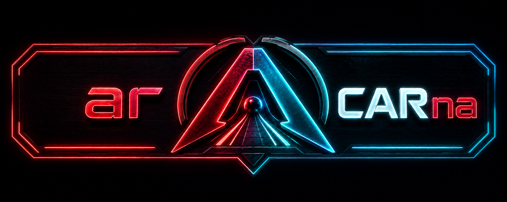

<p align="center">
  
</p>

# arCARna 🏎️🌃

Jeu de course **arcade néon** sous **Godot 4.x** (style Asphalt : sensation de vitesse exagérée,
drift permissif, nitro spectaculaire). Reconstruction d'un prototype Three.js sur une base
robuste et maintenable.

## ✨ Fonctionnalités

- **Conduite arcade scriptée** (`CharacterBody3D`, pas de `VehicleBody3D`) : vitesse avant scalaire,
  cap découplé via le grip, drift facile, marche arrière (gauche/droite inversés).
- **Nitro** : boost + FOV + glow de la voiture + traînée lumineuse.
- **Énergie** : carburant/bouclier qui se vide en roulant et aux chocs, **recharge aux stands**
  (pad animé + aura), **explosion + game over** à zéro.
- **Tours / chrono** : compteur de tours, temps au tour, **meilleur tour sauvegardé** sur disque.
- **HUD** : cadran de vitesse, jauges énergie/nitro, infos de course.
- **Trafic IA** : voitures multicolores (texture désaturée + teinte) suivant la spline.
- **Circuit néon** : modèle Blender (Sol + barrières néon Rouge/Bleu/Vert) avec segments lumineux
  animés ; collision et chevrons de direction **générés automatiquement** depuis la géométrie.
- **Ambiance** : ciel HDRI cyberpunk, glow, fog, ligne de départ en damier, VFX (explosion, étincelles).

## 🎮 Contrôles

| Action | Clavier | Manette |
|---|---|---|
| Accélérer | ↑ / W / Z | RT |
| Freiner / Reculer | ↓ / S | LT |
| Tourner | ← → / A D / Q D | Stick gauche |
| Nitro | Espace / Maj | A / X |
| Drift (frein à main) | Ctrl gauche | B / O |
| Rejouer (game over) | Espace | A |

## 🗂️ Structure

```
scenes/      Main.tscn, Player.tscn
scripts/     player, camera_rig, game_manager (autoload), wall_builder,
             chevrons, track_setup, traffic_manager, pit_zone, finish_line, hud_debug…
assets/
  models/    First_Track.glb, futuristic_car.glb
  shaders/   road/tube/pad/checker/car_tint/vfx_burst/starfield…
  HDRI/      ciel cyberpunk (.exr)
  images/    icône, textures VFX
tools/       scripts de debug/rendu headless (non utilisés au runtime)
```

## ▶️ Lancer

Ouvrir le dossier dans **Godot 4.x**, puis **F5** (scène principale : `scenes/Main.tscn`).

## 🛠️ Build

Un workflow GitHub Actions (`.github/workflows/export.yml`) exporte automatiquement les binaires
**Windows** et **Linux** à chaque push sur `main` (artefacts téléchargeables dans l'onglet *Actions*).
Ajuster `GODOT_VERSION` dans le workflow pour correspondre à la version utilisée.

## 📜 Conception

Voir [`arCARna_godot_briefing.md`](arCARna_godot_briefing.md) pour les piliers de design et l'architecture.

## ⚖️ Licence

Distribué sous licence **GNU GPLv3** — voir [`LICENSE`](LICENSE).

---
*Développé avec [Claude Code](https://claude.com/claude-code).*
